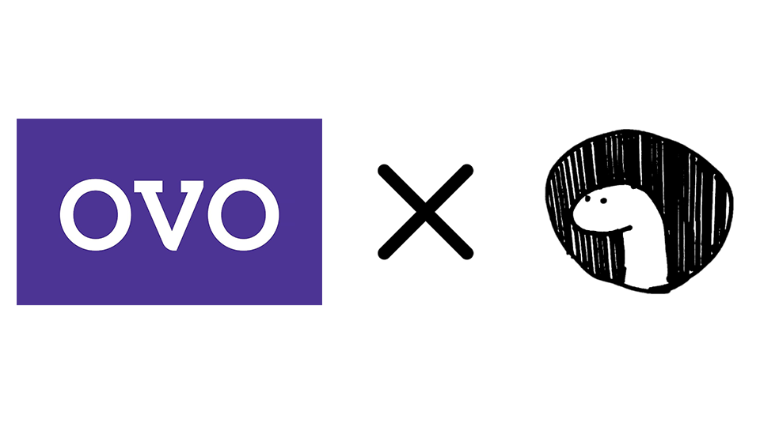

    <h1> Denovo (Un-official Ovo API wrapper for Deno 🦕)</h1>

    

# Description
This is an Un-official Ovo API wrapper for Deno got inspired from [ovoid-nodejs](https://github.com/apriady/ovoid-nodejs) and this is the result porting from [ovoid](https://github.com/lintangtimur/ovoid/)

# Author
[@Satyawikananda](https://instagram.com/satyawikananda) © 2020